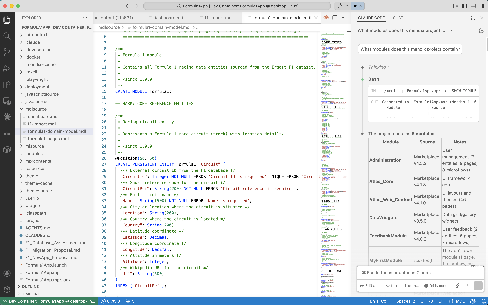
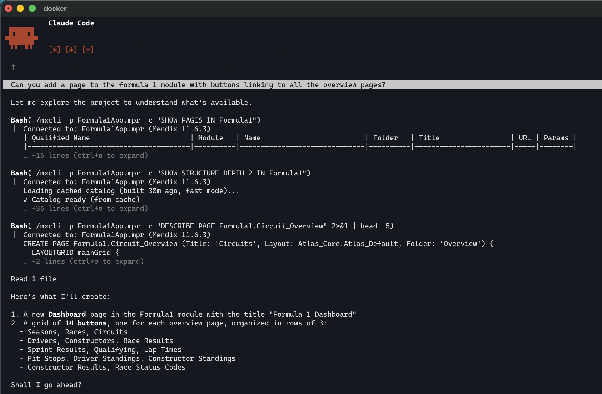
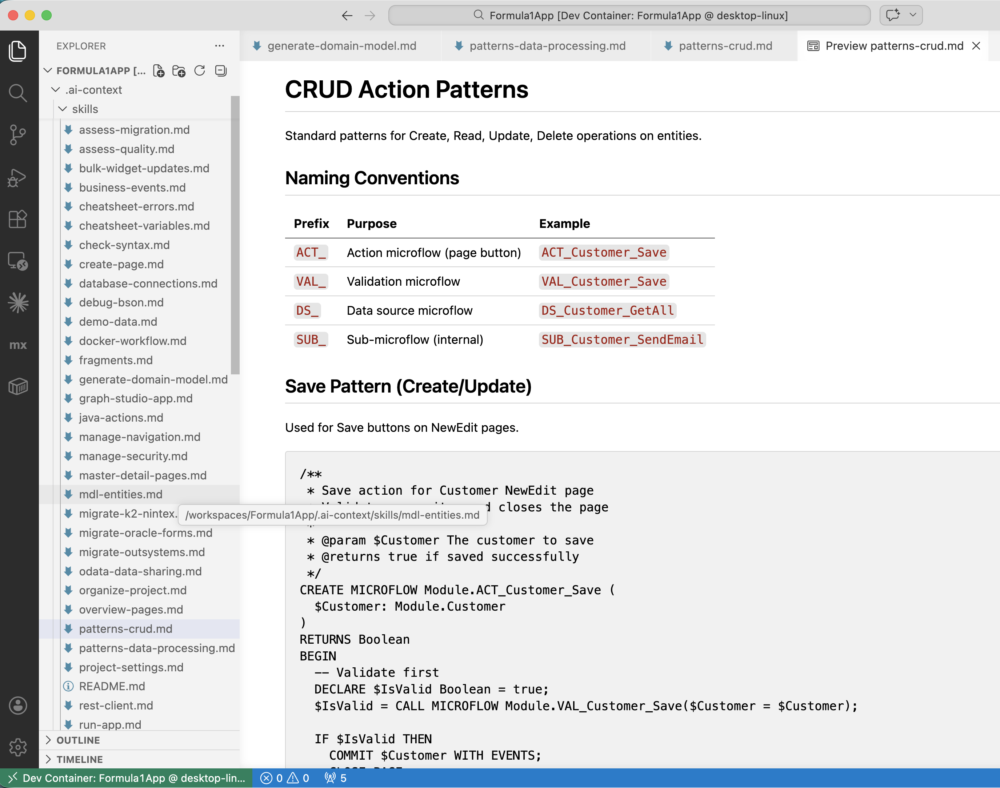
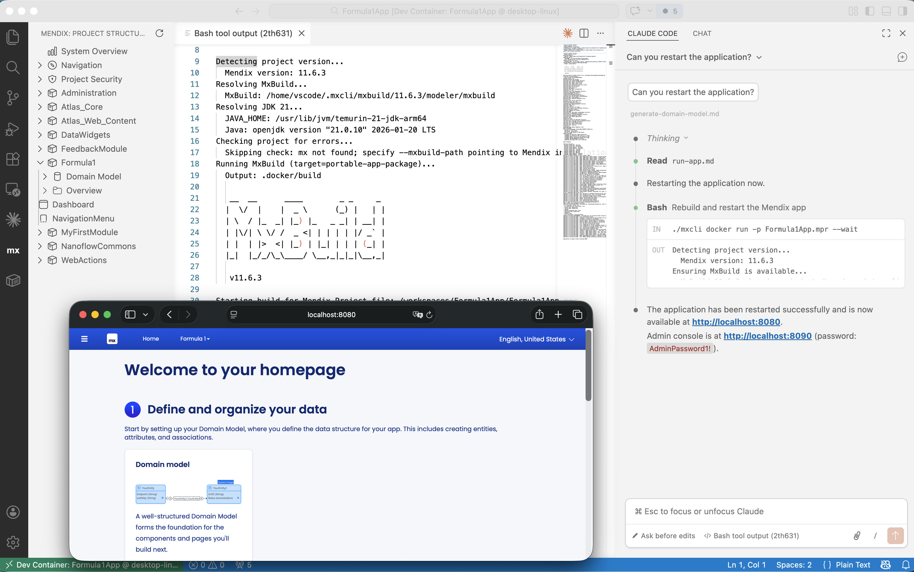

# mxcli - Mendix CLI for AI-Assisted Development

> **WARNING: Alpha-quality software.** This project is in early stages and has been largely vibe-engineered with AI coding assistants. Expect bugs, missing features, and rough edges. **mxcli can corrupt your Mendix project files** — always work on a copy or use version control. Use at your own risk. This has been developed and tested against Mendix 11.6, other versions are currently not validated.

A command-line tool that enables AI coding assistants ([Claude Code](https://claude.ai/claude-code), Cursor, Continue.dev, Windsurf, Aider, and others) to read, understand, and modify Mendix application projects.

## Why mxcli?

Mendix projects are stored in binary `.mpr` files that AI agents can't read directly. `mxcli` bridges this gap by providing:

- **MDL (Mendix Definition Language)** - A SQL-like syntax for querying and modifying Mendix models
- **Multi-tool support** - Works with Claude Code, Cursor, Continue.dev, Windsurf, Aider, and more
- **Full-text search** - Search across all strings, messages, and source definitions
- **Code navigation** - Find callers, callees, references, and impact analysis
- **Catalog queries** - SQL-based querying of project metadata
- **Linting** - Check projects for common issues
- **Unix pipe support** - Output formats designed for scripting and chaining

## What is mxcli?

Mxcli is a tool that enables some of the following use cases.

### A textual DSL for mendix models

MDL, Mendix Definition Language, is a DSL that provides textual models at the same abstraction level as the visual models in Studio Pro. 



### Command line tool to work with Mendix projects

Mxcli command line tool allows you to run commands against your project to investigate your project and make changes.


### A REPL to work with Mendix projects

In repl mode mxcli allows you to interactively work with a Mendix project. This is similar to psql or sqlplus when working with databases. You can list the available Mendix documents, view the MDL source, and make changes.


### Skills and configuration to enable Agentic Coding on Mendix projects

Running *mxcli init* will install configuration files for agentic coding tools like AGENTS.md, CLAUDE.md, and Mendix specific skills. It will also configure a devcontainer that you can use when opening the project in Vscode, so you limit what your agentic coder can impact and see. 


This screenshot shows how Claude uses mxcli command to do agentic search on your Mendix project to understand what is available. It gets a list of pages that are in the specified module, it uses structure to get an overview of all the documents in the module, and then it describes the soure of a specifc page. Based on this info it can make a plan how to modify your project.



### A set of extensible skills

The skills documents teach agentic coding tools how to build Mendix projects. You can add your own skills with design patterns and best practices. Using MDL you can be very specific how the agent should generate the required Mendix documents.



### Metadata Catalog 

Mxcli builds up a set of database tables with information about your project. This allows for flexible agentic search on your project documents.


### A Mendix project linter

The catalog tables are exposed as Starlark APIs so you can use the available data in custom Mendix linter rules.


### VSCode for Mendix projects

The easiest way to use mxcli is in vscode. You can run Claude Code inside vscode, mxcli installs a Mendix vscode extension that helps you review and understand your Mendix project. 


The project structure shows you all modules with document, similar to the app explorer in Mendix Studio Pro. The VSCode extension also provides visualizations for some Mendix document types, ensuring you can review the generated documents without leaving VSCode.


### Run and test your Mendix projects

Claude code can start your Mendix project using PAD (portable application distribution). This will run the Mendix runtime in a docker container, and postgres in another docker container. This allows you to test your Mendix project without leaving vscode.



### Automated Playwright-cli testing for Mendix projects

The devcontainer is configured for use with playwright-cli so Claude Code can test your running application.

### Data migration for Mendix projects

Claude code can migrate existing data, or generate demo data in the postgres container when you run your application.

### Edit your Mendix Project in the browser with GitHub Codespaces


## Quick Start

The recommended way to use mxcli is inside a **Dev Container**. This sandboxes the AI agent so it can only access your project files, preventing unintended changes to your system. `mxcli init` sets up a `.devcontainer/` configuration automatically.

```bash
# Initialize a Mendix project for your AI assistant
mxcli init /path/to/my-mendix-project

# Or specify your tool(s)
mxcli init --tool cursor /path/to/my-mendix-project
mxcli init --tool claude --tool cursor /path/to/my-mendix-project

# This creates:
#   AGENTS.md and .ai-context/ with universal skills
#   .devcontainer/ for sandboxed development
#   Tool-specific config files (.cursorrules, .continue/config.json, etc.)

# Open the project in VS Code / Cursor and reopen in Dev Container,
# then start your AI assistant:
claude  # or use Cursor, Continue.dev, etc.
```

### Supported AI Tools

| Tool | Config File | Description |
|------|------------|-------------|
| **Claude Code** | `.claude/`, `CLAUDE.md` | Full integration with skills and commands |
| **Cursor** | `.cursorrules` | Compact MDL reference and command guide |
| **Continue.dev** | `.continue/config.json` | Custom commands and slash commands |
| **Windsurf** | `.windsurfrules` | Codeium's AI with MDL rules |
| **Aider** | `.aider.conf.yml` | Terminal-based AI pair programming |
| **Universal** | `AGENTS.md` | Works with all tools |

```bash
# List supported tools
mxcli init --list-tools

# Add tool to existing project
mxcli add-tool cursor
```

## Installation

Download the latest release for your platform from the [releases page](https://github.com/mendixlabs/mxcli/releases), or build from source:

```bash
git clone https://github.com/mendixlabs/mxcli.git
cd mxcli
make build
# Binary is at ./bin/mxcli
```

## Core Features

### Explore Project Structure

```bash
# List all modules
mxcli -p app.mpr -c "SHOW MODULES"

# List entities in a module
mxcli -p app.mpr -c "SHOW ENTITIES IN MyModule"

# Describe an entity, microflow, page, or workflow
mxcli describe -p app.mpr entity MyModule.Customer
mxcli describe -p app.mpr microflow MyModule.ProcessOrder
mxcli describe -p app.mpr page MyModule.CustomerOverview
mxcli describe -p app.mpr workflow MyModule.MyWorkflow
```

### Full-Text Search

Search across validation messages, log messages, captions, labels, and MDL source:

```bash
# Search for validation-related content
mxcli search -p app.mpr "validation"

# Pipe-friendly output (type<TAB>name per line)
mxcli search -p app.mpr "error" -q --format names

# JSON output for processing with jq
mxcli search -p app.mpr "Customer" -q --format json
```

Pipe to describe:
```bash
# Describe the first matching microflow
mxcli search -p app.mpr "validation" -q --format names | head -1 | awk '{print $2}' | \
  xargs mxcli describe -p app.mpr microflow

# Process all matches
mxcli search -p app.mpr "error" -q --format names > results.txt
while IFS=$'\t' read -r type name; do
  mxcli describe -p app.mpr "$type" "$name"
done < results.txt
```

### Code Navigation

```bash
# Find what calls a microflow
mxcli callers -p app.mpr MyModule.ProcessOrder
mxcli callers -p app.mpr MyModule.ProcessOrder --transitive

# Find what a microflow calls
mxcli callees -p app.mpr MyModule.ProcessOrder

# Find all references to an element
mxcli refs -p app.mpr MyModule.Customer

# Analyze impact of changing an element
mxcli impact -p app.mpr MyModule.Customer

# Assemble context for understanding code
mxcli context -p app.mpr MyModule.ProcessOrder --depth 3
```

### Widget Discovery and Bulk Updates

> **EXPERIMENTAL**: These commands are an untested proof-of-concept.
> Always use `DRY RUN` first and backup your project before applying changes.

Find and update widget properties across pages and snippets:

```bash
# Discover widgets by type
mxcli -p app.mpr -c "SHOW WIDGETS WHERE WidgetType LIKE '%combobox%'"

# Filter by module
mxcli -p app.mpr -c "SHOW WIDGETS IN MyModule"

# Preview changes (dry run)
mxcli -p app.mpr -c "UPDATE WIDGETS SET 'showLabel' = false WHERE WidgetType LIKE '%DataGrid%' DRY RUN"

# Apply changes
mxcli -p app.mpr -c "UPDATE WIDGETS SET 'showLabel' = false, 'labelWidth' = 4 WHERE WidgetType LIKE '%combobox%' IN MyModule"
```

Requires `REFRESH CATALOG FULL` to populate the widgets table.

### Catalog Queries

SQL-based querying of project metadata:

```bash
# Find microflows with many activities
mxcli -p app.mpr -c "SELECT Name, ActivityCount FROM CATALOG.MICROFLOWS WHERE ActivityCount > 10 ORDER BY ActivityCount DESC"

# Find all entity usages
mxcli -p app.mpr -c "REFRESH CATALOG FULL; SELECT SourceName, RefKind, TargetName FROM CATALOG.REFS WHERE TargetName = 'MyModule.Customer'"

# Search strings table directly
mxcli -p app.mpr -c "SELECT * FROM CATALOG.STRINGS WHERE strings MATCH 'error' LIMIT 10"
```

Available tables: `MODULES`, `ENTITIES`, `MICROFLOWS`, `NANOFLOWS`, `PAGES`, `SNIPPETS`, `ENUMERATIONS`, `WORKFLOWS`, `ACTIVITIES`, `WIDGETS`, `REFS`, `PERMISSIONS`, `STRINGS`, `SOURCE`

### Linting

```bash
# Lint a project
mxcli lint -p app.mpr

# SARIF output for CI/GitHub integration
mxcli lint -p app.mpr --format sarif > results.sarif

# List available rules
mxcli lint -p app.mpr --list-rules

# Exclude modules
mxcli lint -p app.mpr --exclude System --exclude Administration
```

14 built-in Go rules (MPR001-MPR007, SEC001-SEC003, CONV011-CONV014) plus 27 bundled Starlark rules covering security (SEC004-SEC009), architecture (ARCH001-003), quality (QUAL001-004), design (DESIGN001), and Mendix best practice conventions (CONV001-CONV010, CONV015-CONV017). Custom `.star` rules in `.claude/lint-rules/` are loaded automatically.

### Best Practices Report

```bash
# Generate a scored report (Markdown)
mxcli report -p app.mpr

# HTML report
mxcli report -p app.mpr --format html --output report.html

# JSON report for CI
mxcli report -p app.mpr --format json
```

The report evaluates the project across 6 categories (Security, Quality, Architecture, Performance, Naming, Design) with a 0-100 score per category and overall.

### Testing

Test microflows using MDL syntax with javadoc-style annotations:

```bash
# Run tests
mxcli test tests/microflows.test.mdl -p app.mpr

# List tests without executing
mxcli test tests/ --list

# JUnit XML output for CI
mxcli test tests/ -p app.mpr --junit results.xml
```

Tests use `@test` and `@expect` annotations in `.test.mdl` or `.test.md` files. See `mxcli help test` for full syntax.

### Create and Modify

```bash
# Execute MDL commands
mxcli -p app.mpr -c "CREATE ENTITY MyModule.Product (Name: String(200) NOT NULL, Price: Decimal)"

# Execute an MDL script file
mxcli -p app.mpr -c "EXECUTE SCRIPT 'setup.mdl'"

# Check MDL syntax before executing
mxcli check script.mdl

# Check syntax and validate references
mxcli check script.mdl -p app.mpr --references

# Preview changes (diff against current state)
mxcli diff -p app.mpr changes.mdl
```

## MDL Language

MDL (Mendix Definition Language) is a SQL-like syntax for working with Mendix models:

```sql
-- Show project structure
SHOW MODULES;
SHOW ENTITIES IN MyModule;
DESCRIBE ENTITY MyModule.Customer;
DESCRIBE MICROFLOW MyModule.ProcessOrder;
DESCRIBE PAGE MyModule.CustomerOverview;

-- Create entities
CREATE ENTITY MyModule.Product (
  Name: String(200) NOT NULL,
  Price: Decimal(10,2),
  IsActive: Boolean DEFAULT true
);

-- Create associations
CREATE ASSOCIATION MyModule.Order_Product
  FROM MyModule.Order TO MyModule.Product
  TYPE ReferenceSet;

-- Create pages
CREATE PAGE MyModule.Product_Edit
(
  Params: { $Product: MyModule.Product },
  Title: 'Edit Product',
  Layout: Atlas_Core.PopupLayout
)
{
  DATAVIEW dvProduct (DataSource: $Product) {
    TEXTBOX txtName (Label: 'Name', Attribute: Name)
    TEXTBOX txtPrice (Label: 'Price', Attribute: Price)
    CHECKBOX cbActive (Label: 'Active', Attribute: IsActive)

    FOOTER footer1 {
      ACTIONBUTTON btnSave (Caption: 'Save', Action: SAVE_CHANGES, ButtonStyle: Primary)
      ACTIONBUTTON btnCancel (Caption: 'Cancel', Action: CANCEL_CHANGES)
    }
  }
}

-- Security management
CREATE MODULE ROLE MyModule.Admin DESCRIPTION 'Full access';
CREATE MODULE ROLE MyModule.Viewer DESCRIPTION 'Read-only';
GRANT EXECUTE ON MICROFLOW MyModule.ProcessOrder TO MyModule.Admin;
GRANT VIEW ON PAGE MyModule.Product_Edit TO MyModule.Admin, MyModule.Viewer;
GRANT MyModule.Admin ON MyModule.Product (CREATE, DELETE, READ *, WRITE *);
GRANT MyModule.Viewer ON MyModule.Product (READ *);
CREATE USER ROLE AppAdmin (MyModule.Admin) MANAGE ALL ROLES;
ALTER PROJECT SECURITY LEVEL PRODUCTION;
SHOW SECURITY MATRIX IN MyModule;

-- Search
SEARCH 'validation';

-- Code navigation
SHOW CALLERS OF MyModule.ProcessOrder TRANSITIVE;
SHOW REFERENCES TO MyModule.Customer;
SHOW IMPACT OF MyModule.Customer;
SHOW CONTEXT OF MyModule.ProcessOrder DEPTH 3;

-- Widget discovery and bulk updates
SHOW WIDGETS WHERE WidgetType LIKE '%combobox%';
UPDATE WIDGETS SET 'showLabel' = false WHERE WidgetType LIKE '%DataGrid%' DRY RUN;
```

Run `mxcli syntax` for MDL syntax reference, or `mxcli syntax <topic>` for specific topics:
- `mxcli syntax keywords` - Reserved keywords
- `mxcli syntax entity` - Entity creation syntax
- `mxcli syntax microflow` - Microflow creation syntax
- `mxcli syntax page` - Page creation syntax
- `mxcli syntax search` - Full-text search syntax

## AI Assistant Integration

The `mxcli init` command sets up a Mendix project for AI-assisted development:

```bash
# Default: Claude Code + universal docs
mxcli init /path/to/my-mendix-project

# Specify tool(s)
mxcli init --tool cursor /path/to/my-mendix-project
mxcli init --tool claude --tool cursor /path/to/my-mendix-project

# All tools
mxcli init --all-tools /path/to/my-mendix-project

# Add tool to existing project
mxcli add-tool cursor
```

### What Gets Created

**Universal (all tools):**
- `AGENTS.md` - Comprehensive guide for AI assistants
- `.ai-context/skills/` - MDL pattern guides (write-microflows.md, create-page.md, etc.)
- `.ai-context/examples/` - Example MDL scripts

**Tool-Specific:**
- **Claude Code**: `.claude/settings.json`, `CLAUDE.md`, commands, lint-rules, skills
- **Cursor**: `.cursorrules` - Compact MDL reference
- **Continue.dev**: `.continue/config.json` - Custom commands and slash commands
- **Windsurf**: `.windsurfrules` - MDL rules for Codeium
- **Aider**: `.aider.conf.yml` - YAML config for Aider

**VS Code Extension** (auto-installed with Claude):
- Syntax highlighting and diagnostics
- Hover and go-to-definition
- Code completion
- Context menu commands

### Dev Container

`mxcli init` generates a `.devcontainer/` configuration that provides a sandboxed development environment. This is the recommended way to run AI coding agents — it limits their access to just the project files.

**What's installed in the dev container:**

| Component | Purpose |
|-----------|---------|
| **mxcli** | Mendix CLI for AI-assisted development (copied into project) |
| **MxBuild / mx** | Mendix project validation and building (`~/.mxcli/mxbuild/`) |
| **JDK 21** (Adoptium) | Required by MxBuild |
| **Docker-in-Docker** | Running Mendix apps locally with `mxcli docker` |
| **Node.js** | Playwright testing support |
| **PostgreSQL client** | Database connectivity |
| **Claude Code** | AI coding assistant (auto-installed on container creation) |

**Key paths inside the dev container:**

```
~/.mxcli/mxbuild/{version}/modeler/mx    # mx check / mx build
~/.mxcli/runtime/{version}/               # Mendix runtime (auto-downloaded)
./mxcli                                    # Project-local mxcli binary
```

MxBuild is auto-downloaded on first use (via `mxcli setup mxbuild -p app.mpr` or `mxcli docker build`). To validate a project:

```bash
# Auto-download mxbuild and check project
mxcli setup mxbuild -p app.mpr
~/.mxcli/mxbuild/*/modeler/mx check app.mpr

# Or use the integrated command
mxcli docker check -p app.mpr
```

### Usage

After initialization, open the project in VS Code or Cursor and **reopen in Dev Container**, then start your AI assistant:
```bash
claude              # Claude Code
# or use Cursor, Continue.dev, Windsurf, etc.
```

The AI assistant will have access to:
- MDL command reference in `AGENTS.md`
- Pattern guides in `.ai-context/skills/`
- Tool-specific configuration
- Full project context via `mxcli` commands

## VS Code Extension

The MDL extension for VS Code provides a rich editing experience for `.mdl` files:

- **Syntax highlighting** and **parse diagnostics** as you type
- **Semantic diagnostics** on save (validates references against the project)
- **Code completion** with context-aware keyword and snippet suggestions
- **Hover** over `Module.Name` references to see their MDL definition
- **Go-to-definition** (Ctrl+click) to open element source as a virtual document
- **Document outline** and **folding** for MDL statements and blocks
- **Context menu** commands: Run File, Run Selection, Check File

The extension is automatically installed by `mxcli init`. To install manually:
```bash
make vscode-install
# or: code --install-extension vscode-mdl/vscode-mdl-*.vsix
```

**Settings:**
- `mdl.mxcliPath` - Path to the mxcli executable (default: `mxcli`)
- `mdl.mprPath` - Path to `.mpr` file (auto-discovered if empty)

## Code Quality Monitoring

The `source_tree` tool provides a visual overview of the codebase, showing file sizes, dependency tiers, and optional quality metrics:

```bash
# Basic source tree (file sizes + dependency depth)
go run ./cmd/source_tree

# With function metrics (count, longest function per file)
go run ./cmd/source_tree --fn

# With intra-file duplication detection
go run ./cmd/source_tree --dup

# With churn (commit frequency per file)
go run ./cmd/source_tree --churn

# All metrics at once
go run ./cmd/source_tree --all

# With test coverage (runs tests first if no coverage.out exists)
go run ./cmd/source_tree --cover
```

Output is color-coded by severity (green/yellow/orange/red) for each metric, making it easy to spot files that need attention.

## Building from Source

```bash
# Prerequisites: Go 1.24+, Make

# Build
make build

# Run tests
make test

# Build release binaries for all platforms
make release

# Regenerate parser (requires ANTLR4)
make grammar
```

## Compatibility

- **Mendix versions**: Studio Pro 8.x, 9.x, 10.x, 11.x
- **MPR formats**: Both v1 and v2 (with mprcontents folder)
- **Platforms**: Linux, macOS, Windows (amd64 and arm64)

## Go Library

`mxcli` is built on a Go library for reading and modifying Mendix projects. If you want to use the library directly:

```go
import "github.com/mendixlabs/mxcli"

// Read a project
reader, _ := modelsdk.Open("/path/to/app.mpr")
modules, _ := reader.ListModules()
dm, _ := reader.GetDomainModel(modules[0].ID)

// Write to a project
writer, _ := modelsdk.OpenForWriting("/path/to/app.mpr")
entity := modelsdk.NewEntity("Customer")
writer.CreateEntity(dm.ID, entity)
```

See [docs/GO_LIBRARY.md](docs/GO_LIBRARY.md) for full API documentation.

## License

Apache License 2.0 - See [LICENSE](LICENSE) for details.

## Contributing

Contributions are welcome! Please feel free to submit a Pull Request.
