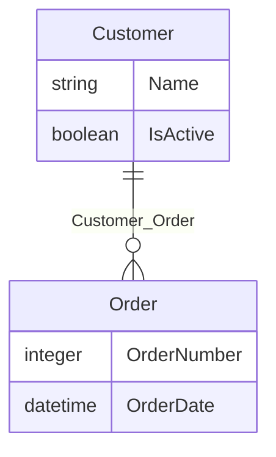
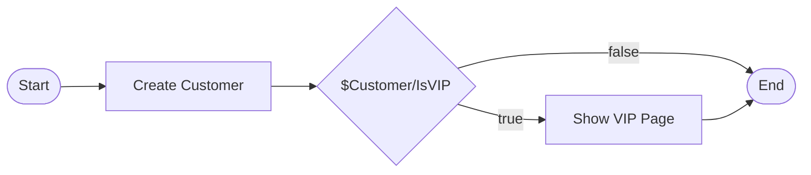

# Diagram Viewer Architecture

This document describes the architecture of the Mermaid.js-based diagram viewer in the VS Code MDL extension, which renders visual diagrams for Mendix domain models, microflows, and pages.

## Overview

The viewer renders Mendix model diagrams in a VS Code side panel. The pipeline has three stages:

```
Go backend (mxcli)  →  Mermaid.js  →  SVG in WebviewPanel
    generates text       parses text      renders graphics
    diagram spec         into vector       with pan/zoom
                         graphics          and interactivity
```

## Data Flow

```
MPR file
  │  (modelsdk-go reads BSON)
  ▼
entity / microflow / page structs
  │  (cmd_mermaid.go formats)
  ▼
Mermaid text + %% metadata comments
  │  (child_process.execFile in VS Code extension)
  ▼
previewProvider.ts receives stdout
  │  (embedded in HTML template)
  ▼
WebviewPanel loads HTML page
  │  (mermaid.run() in browser)
  ▼
SVG elements in DOM
  │  (postRender javascript)
  ▼
Colored, interactive, pannable diagram
```

## Stage 1: Mermaid Text Generation (Go Backend)

**File:** `mdl/executor/cmd_mermaid.go`

The Go backend reads Mendix model data from the MPR file and outputs **Mermaid syntax** — a plain-text diagram description language (like Markdown, but for diagrams). Each diagram type maps to a different Mermaid diagram type:

| MDL Type | Mermaid Type | Description |
|----------|-------------|-------------|
| Domain Model | `erDiagram` | Entities, attributes, associations, generalizations |
| Microflow | `flowchart LR` | Activities, splits, merge points, sequence flows |
| Page | `block-beta` | Widget tree structure |

### Domain Model Example



### Microflow Example



### Metadata Comments

The Go backend appends metadata as Mermaid comments (`%%`) that Mermaid ignores but the webview JavaScript parses:

| Metadata | Purpose | Example |
|----------|---------|---------|
| `%% @type` | Diagram type identifier | `%% @type flowchart` |
| `%% @direction` | Flow direction (LR or TD) | `%% @direction LR` |
| `%% @colors` | Entity type classification for coloring | `%% @colors {"Customer":"persistent","OrderView":"view"}` |
| `%% @nodeinfo` | Activity detail properties for expand/click | `%% @nodeinfo {"n_def":["entity: Module.Customer","Output: $NewCustomer"]}` |

### Entry Point

The CLI command `mxcli describe --format mermaid <type> <name>` triggers generation:

1. `cmd/mxcli/main.go` parses the `--format` flag
2. If `mermaid`, calls `executor.DescribeMermaid(objectType, name)`
3. `DescribeMermaid` dispatches to `domainModelToMermaid`, `microflowToMermaid`, or `pageToMermaid`
4. Each function reads model data via `modelsdk-go` and writes Mermaid text to stdout

### Entity Classification (Domain Model Colors)

Entities are classified into categories for visual distinction:

| Category | Color | Criteria |
|----------|-------|----------|
| Persistent | Blue (#4a90d9) | Default — standard database-backed entities |
| Non-Persistent | Orange (#e8a838) | `entity.Persistable == false` |
| External | Purple (#9b59b6) | OData source or remote source document present |
| View | Green (#27ae60) | Source contains "OqlView" |

### Activity Detail Properties (Microflow Nodes)

The `mermaidActivityDetails()` function extracts rich property information from each microflow activity type:

| Action Type | Detail Properties |
|-------------|-------------------|
| Create Object | Entity name, output variable, commit mode, member assignments |
| Change Object | Target variable, member assignments, commit mode |
| Retrieve | Entity, XPath WHERE clause, range/limit, sort fields |
| Microflow Call | Microflow name, parameter mappings, result variable |
| Show Page | Page name, location (popup/modal), parameter mappings |
| Commit / Delete / Rollback | Target variable name |
| Log Message | Level, node name, message preview |
| Show Message | Message type, message preview |
| Validation Feedback | Target object.attribute, message preview |
| Exclusive Split | Full condition expression |
| Loop | List variable, iterator variable |

## Stage 2: Mermaid.js (Browser Library)

**Library:** [Mermaid.js](https://mermaid.js.org/) v11 (loaded from CDN)

Mermaid.js is an open-source JavaScript library that parses text diagram descriptions and generates **SVG** (Scalable Vector Graphics). It handles the hard layout problems — positioning nodes, routing edges, calculating label placement, applying themes.

### How It Works

```js
import mermaid from 'https://cdn.jsdelivr.net/npm/mermaid@11/dist/mermaid.esm.min.mjs';

mermaid.initialize({
    startOnLoad: false,
    theme: isDark ? 'dark' : 'default',
    securityLevel: 'loose',
    er: { useMaxWidth: false },
    flowchart: { useMaxWidth: false, htmlLabels: true },
});

await mermaid.run();
```

Key configuration:

- `startOnLoad: false` — We control when rendering happens (needed for re-renders on toggle)
- `securityLevel: 'loose'` — Allows HTML in node labels (needed for `<br/><small>` detail expansion)
- `htmlLabels: true` — Enables rich text in flowchart nodes
- `useMaxWidth: false` — Prevents auto-scaling so pan/zoom works correctly
- `theme` — Detects VS Code dark/light theme via CSS variables

### Input / Output

Mermaid finds `<pre class="mermaid">` elements in the DOM, parses their text content, and replaces them with rendered `<svg>` elements. We don't control Mermaid's internals — it takes our text, runs its own graph layout algorithm, and outputs SVG.

## Stage 3: SVG (The Rendered Diagram)

SVG (Scalable Vector Graphics) is an XML-based vector graphics format that browsers render natively. After Mermaid runs, the DOM contains structured vector elements:

```html
<svg viewBox="0 0 800 400" xmlns="http://www.w3.org/2000/svg">
  <g id="entity-Customer" class="er entity">
    <rect class="er entityBox" x="10" y="10" width="150" height="80" />
    <text class="er entityLabel" x="85" y="35">Customer</text>
    <text x="85" y="55">string Name</text>
  </g>
  <path d="M160,50 L300,50" class="er relationshipLine" />
  ...
</svg>
```

Each entity is a `<rect>` + `<text>`, each relationship is a `<path>`, each flowchart node is a `<rect>` or `<polygon>` with label text. SVG elements can be styled and manipulated with the same DOM APIs as HTML (`querySelector`, `addEventListener`, `style`).

## CSS and the Styling Cascade

There are **three layers of styling** that compete for control over SVG element appearance:

```
Priority (highest wins):
┌─────────────────────────────────────────────────────────────┐
│ 1. Inline styles      element.style.fill = '#4a90d9'        │  ← Our color overrides
│ 2. CSS rules          .er.entityBox { fill: #ececff; }      │  ← Mermaid's theme
│ 3. SVG attributes     <rect fill="#4a90d9" />               │  ← Lowest priority
└─────────────────────────────────────────────────────────────┘
```

**Mermaid** applies its theme colors via CSS rules (layer 2) using class names like `.er.entityBox`. This is why using `rect.setAttribute('fill', ...)` (layer 3) does **not** work — CSS rules override SVG presentation attributes.

Our entity coloring uses `rect.style.fill = ...` (layer 1, inline styles), which has the highest specificity and successfully overrides Mermaid's CSS theme.

### Diagram Theme (`mdl.diagramTheme`)

The extension supports two visual themes for all ELK.js-based SVG diagrams (domain models, microflows, pages, module overviews, query plans):

| Theme | Description |
|-------|-------------|
| `clean` (default) | Professional look — straight lines, system fonts, solid fills, subtle drop shadows, no PoC badges |
| `sketch` | Hand-drawn look — wobbly lines, marker hatched fills, Architects Daughter cursive font, pencil-jitter SVG filters, "PoC draft" badges |

The theme is controlled by the `mdl.diagramTheme` VS Code setting. The implementation uses a single set of drawing primitives in `sketchHelpers.ts` that branch on a global `diagramTheme` variable. For the clean theme, the `#pencil` SVG filter is defined as a no-op identity transform, so existing `filter="url(#pencil)"` references throughout the renderers produce clean output without per-site changes.

### VS Code Theme Integration

The webview inherits VS Code's theme via CSS custom properties:

```css
body {
    background-color: var(--vscode-editor-background, #1e1e1e);
    color: var(--vscode-editor-foreground, #d4d4d4);
    font-family: var(--vscode-font-family, sans-serif);
}
.toolbar button {
    background: var(--vscode-button-background, #0e639c);
    color: var(--vscode-button-foreground, #fff);
}
```

The Mermaid theme (dark or default) is selected based on VS Code's theme kind, detected via `data-vscode-theme-kind` attribute and the `--vscode-editor-background` CSS variable.

## The WebviewPanel

**File:** `vscode-mdl/src/previewProvider.ts`

VS Code's `WebviewPanel` is an embedded Chromium iframe. The `MdlPreviewProvider` class manages a single panel instance that generates a complete HTML page containing:

### HTML Structure

```
┌──────────────────────────────────────────────────────┐
│ Toolbar: [title] [zoom%] [Fit] [+] [-] [↕LR] [Details] [source] [Copy] │
├──────────────────────────────────────────────────────┤
│ Legend: ■ persistent  ■ non-persistent  ■ external  ■ view              │
├──────────────────────────────────────────────────────┤
│                                                      │
│  diagram-viewport (pan/zoom container)               │
│    └─ diagram-canvas (CSS transform target)          │
│        └─ <svg> (Mermaid-generated diagram)          │
│                                                      │
├──────────────────────────────────────────────────────┤
│ node-popover (floating detail panel, hidden)         │
├──────────────────────────────────────────────────────┤
│ source-view (raw Mermaid text, hidden)               │
└──────────────────────────────────────────────────────┘
```

### Script Architecture

The HTML page contains two `<script>` blocks:

1. **Module script** (`type="module"`): Imports Mermaid from CDN, configures it, triggers rendering, exposes `window.__mermaid` for re-renders
2. **Regular script**: All interactive logic — pan/zoom, metadata parsing, toggles, popovers

Non-module scripts execute synchronously before module scripts, so all state and functions are defined before Mermaid renders.

## Interactive Features

### Pan and Zoom

Pan/zoom is implemented with CSS transforms on the diagram container, not by modifying the SVG:

```js
canvas.style.transform = `translate(${panX}px, ${panY}px) scale(${scale})`;
```

| Interaction | Behavior |
|-------------|----------|
| Mouse wheel | Zoom toward cursor position |
| Click + drag | Pan the diagram |
| Fit button | Scale to fit viewport with 5% padding |
| +/- buttons | Zoom in/out from viewport center |

The zoom-toward-cursor math ensures the point under the cursor stays fixed during zoom:

```js
panX = mx - (mx - panX) * (newScale / scale);
panY = my - (my - panY) * (newScale / scale);
```

### Direction Toggle (Flowcharts Only)

Visible only when `%% @type flowchart` is detected. Toggles between `flowchart LR` (left-to-right) and `flowchart TD` (top-down) by rewriting the Mermaid source and calling `rerender()`.

### Details Toggle (Flowcharts Only)

Visible only when `%% @nodeinfo` metadata is present. Toggles between compact and expanded node labels. When expanded, detail lines are injected into node labels as `<br/><small>...</small>` HTML (enabled by `htmlLabels: true` and `securityLevel: 'loose'`).

### Click-to-Popover (Flowcharts Only)

After rendering, click handlers are attached to SVG nodes that have entries in `nodeInfo`. Clicking a node shows a floating popover with all property detail lines. The popover is positioned near the click point and kept within the viewport bounds.

### Source View

Toggles between the rendered diagram and the raw Mermaid text source. The "Copy" button copies the Mermaid source to the clipboard.

## Post-Render Pipeline

After Mermaid generates the SVG, `window.postRender()` applies our customizations. The function is wrapped by the click-handler setup code using the decorator pattern:

```js
// Original: colors + fit
window.postRender = function() { /* apply colors, resetView */ };

// Wrapped: adds click handlers after colors
const origPostRender = window.postRender;
window.postRender = function() {
    origPostRender();           // colors + fit
    /* attach click handlers */ // interactive details
};
```

Post-render steps:

1. Remove Mermaid's `max-width` on the SVG (required for pan/zoom to work)
2. Show color legend if `%% @colors` metadata exists
3. Apply entity colors via inline CSS styles (two-pass: by entity group ID, then by text label matching)
4. Attach click handlers to flowchart nodes with `%% @nodeinfo` details
5. Fit diagram to viewport after a 50ms delay (allows SVG layout to settle)

### Re-rendering

The `rerender()` function handles direction toggle and details toggle. It builds updated Mermaid source via `buildCurrentSource()` (applies current direction + detail expansion), creates a fresh `<pre class="mermaid">` element, clears the canvas, and calls `mermaid.run()` + `postRender()` again.

## File Map

| File | Role |
|------|------|
| `mdl/executor/cmd_mermaid.go` | Mermaid text generation (Go) — ER diagrams, flowcharts, block diagrams |
| `vscode-mdl/src/previewProvider.ts` | WebviewPanel manager — HTML generation, mxcli subprocess, panel lifecycle |
| `vscode-mdl/src/extension.ts` | Command registration — `mendix.previewDiagram` command + tree/editor menu |
| `vscode-mdl/package.json` | VS Code contribution points — command, menus, editor title button |
| `cmd/mxcli/main.go` | CLI `--format` flag routing — dispatches to `DescribeMermaid()` |

## Supported Diagram Types

| Type | Mermaid Syntax | Features |
|------|---------------|----------|
| Domain Model | `erDiagram` | Entity boxes with attributes, association lines with cardinality, generalization arrows, color by entity type (persistent/non-persistent/external/view), legend |
| Microflow | `flowchart LR/TD` | Activity nodes, decision diamonds, merge circles, loop trapezoids, edge labels for split cases, start node coloring, direction toggle, detail expansion, click-to-popover |
| Page | `block-beta` | Nested widget tree with container/leaf blocks |
