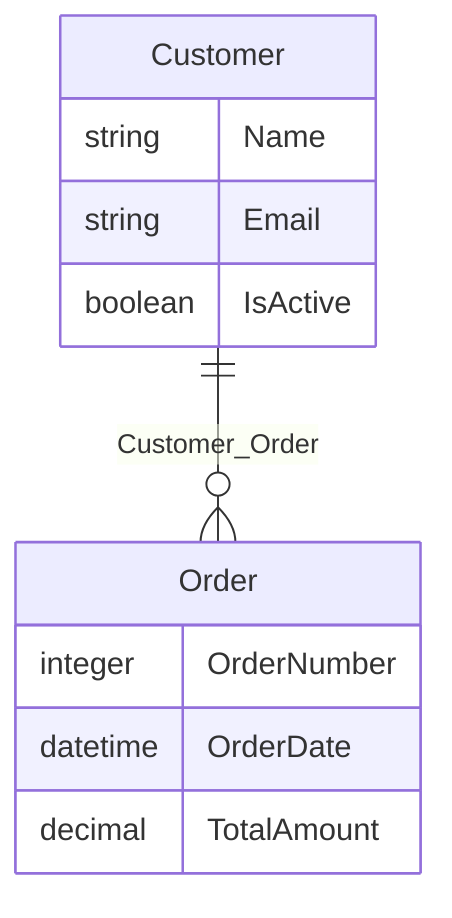
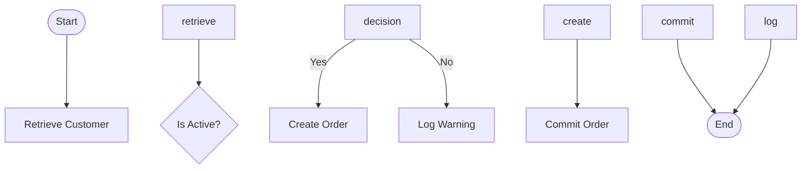
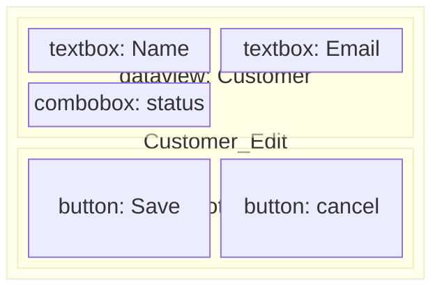

# Proposal: VS Code MDL Visualizations

## Summary

Add visual diagram previews to the VS Code MDL extension, enabling users to see entity-relationship diagrams, microflow flowcharts, page wireframes, and dependency graphs alongside MDL source code.

## Current State

The extension is currently a **text-based navigation and execution tool**:

- **Tree view** — hierarchical project structure (modules, entities, microflows, pages, etc.)
- **Virtual documents** — read-only MDL source via `mendix-mdl://describe/` scheme
- **Terminal commands** — catalog queries (context, impact, callers, callees, references)
- **LSP** — hover, go-to-definition, completion, diagnostics
- **Syntax highlighting** — TextMate grammar for MDL

There are no graphical visualizations, diagrams, or preview panels.

## Options

### Option A: Webview Preview Panel (Markdown Preview Style)

A side-by-side panel that opens next to the MDL source document, similar to how Markdown Preview or Mermaid Preview works.

**How it works:**

- Add a "Preview" button (eye icon) in the editor title bar when an MDL document is active
- Opens a `WebviewPanel` beside the current editor
- The webview renders SVG/HTML diagrams generated from the MDL/project data
- Updates live as you navigate between elements or edit MDL

**What it could visualize:**

- **Domain models**: Entity-relationship diagrams (entities as boxes, associations as lines)
- **Microflows**: Flowchart diagrams (activities as nodes, flows as arrows)
- **Pages**: Wireframe-style layout preview (boxes representing widgets)
- **Call graphs**: Dependency diagrams from `show context of` / `show callers of`

**Rendering options:**

1. **Mermaid.js** — Generate Mermaid syntax from mxcli, render in webview. Simplest to implement, decent ER diagrams and flowcharts, but limited layout control.
2. **D3.js / ELK.js** — Custom SVG rendering with proper auto-layout (ELK is what Eclipse/Mendix uses). Best results, most work.
3. **Server-side SVG** — Have mxcli generate SVG directly (e.g., using Go SVG libraries), serve as static content. Keeps logic in Go, webview just displays.

**Pros:**

- Familiar UX pattern (every VS Code user knows Markdown Preview)
- Rich rendering (full HTML/CSS/JS available)
- Can be interactive (click a node to navigate to its source)
- Side-by-side with MDL source creates a powerful editing experience

**Cons:**

- Webviews are heavier (memory, complexity)
- Need to pick/bundle a rendering library
- Webview state management adds code

### Option B: Special Tree Nodes that Open Diagrams

Add diagram nodes in the project tree (e.g., "Domain Model Diagram" under each module) that open a webview when clicked.

**How it works:**

- Under each module in the tree, add virtual nodes like:
  - `Domain model Diagram`
  - `microflow Diagram: ACT_ProcessOrder`
  - `Dependency Graph`
- Clicking opens a webview (not a text document) with the visualization
- Tree node `contextValue` distinguishes diagram nodes from element nodes

**Pros:**

- Clear discoverability — users see diagrams in the tree
- Natural for "overview" visualizations (full domain model, module dependency graph)
- Can coexist with Option A

**Cons:**

- Pollutes the tree with non-element items
- Less natural for per-element visualizations (you'd need a diagram node for every microflow)
- Still uses webviews internally, so same rendering complexity

### Option C: Hybrid — CodeLens + Preview Command

Add CodeLens annotations inline in MDL source that offer "Show Diagram" links, plus a command palette entry.

**How it works:**

- CodeLens appears above `create entity`, `create microflow`, etc. statements in MDL files
- Clicking "Show Diagram" opens the visualization in a side panel
- Also available via command palette: "MDL: Preview Diagram"
- Also available from tree context menu: "Open as Diagram"

**Pros:**

- Non-intrusive, contextual
- Works from multiple entry points

**Cons:**

- CodeLens requires LSP support (already have LSP, so feasible)
- Less discoverable than a dedicated button or tree node

## Recommendation

**Option A (Preview Panel) as the primary approach**, with a small addition from Option B for module-level overview diagrams.

**Reasoning:**

1. The **preview panel pattern** is the most familiar VS Code UX for visualizations — users already know it from Markdown, Mermaid, PlantUML, etc.
2. It works naturally for **all element types** (entities, microflows, pages) without cluttering the tree
3. The tree already has a context menu — adding "Open as Diagram" there is trivial
4. For **module-level overview** diagrams (full ER diagram, dependency graph), a few special tree nodes under each module make sense as discovery points

**For rendering**, start with **Mermaid.js** for rapid iteration (ER diagrams and flowcharts are well-supported), with the option to move to ELK.js later for better layout control on complex microflows.

## Implementation Sketch

### New Components

| Component | Description |
|-----------|-------------|
| `MdlPreviewProvider` | Manages webview panel lifecycle, receives data, renders diagrams |
| `mendix.previewElement` command | Opens webview preview for a given element |
| Editor title button | Eye icon when language is `mdl` or scheme is `mendix-mdl` |
| Tree context menu entry | "Open as Diagram" for entities, microflows, pages |
| `mxcli describe --format mermaid` | New output format producing Mermaid diagram syntax |
| Virtual tree nodes | 1-2 per module for overview diagrams (domain model, dependency graph) |

### Data Flow

```
Tree click / Preview button
        |
        v
mendix.previewElement command
        |
        v
mxcli describe --format mermaid <type> <qualifiedName>
        |
        v
Mermaid syntax returned
        |
        v
WebviewPanel renders with mermaid.js
```

### Visualization Types

| Element Type | Diagram Style | Example |
|-------------|--------------|---------|
| Domain Model | ER diagram | Entities as boxes, associations as lines, attributes listed |
| Microflow | Flowchart | Activities as nodes, flows as arrows, decisions as diamonds |
| Page | Wireframe | Nested boxes representing widget hierarchy with labels |
| Call Graph | Directed graph | Nodes = microflows/pages, edges = calls/shows |
| Module Overview | Combined ER + dependency | All entities + associations + key microflow connections |

### Mermaid Examples

**Domain Model (ER Diagram):**



**Microflow (Flowchart):**



**Page (Wireframe-like):**



## Open Questions

1. **Interactive navigation** — Should clicking a node in the diagram navigate to the MDL source (or open that element's own diagram)?
2. **Edit-and-refresh** — Should the preview auto-update when MDL is executed against the project, or require manual refresh?
3. **Theme support** — Should diagrams respect VS Code light/dark theme? (Mermaid supports this natively.)
4. **Export** — Should users be able to export diagrams as SVG/PNG for documentation?
5. **Scope** — Which visualization types to implement first? Domain model ER diagrams are likely the highest value and simplest starting point.
